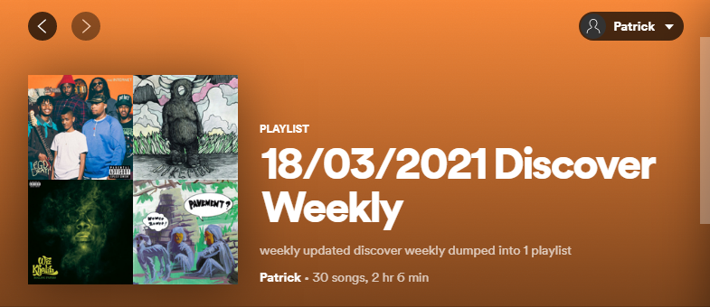

# Spotify API Python Project: 'Discover Weekly' playlist dump

Spotify offers a 'Discover Weekly' playlist that has songs that are similar to songs that a user has been listening to recently.  
In my experience, I usually find several songs that I like on this playlist, but the problem is the playlist wipes and regenerates itself weekly, and no songs from previous weeks appear on the current playlist.  
So this script copies all the songs from the current Discover Weekly playlist into a new playlist with the date.  

